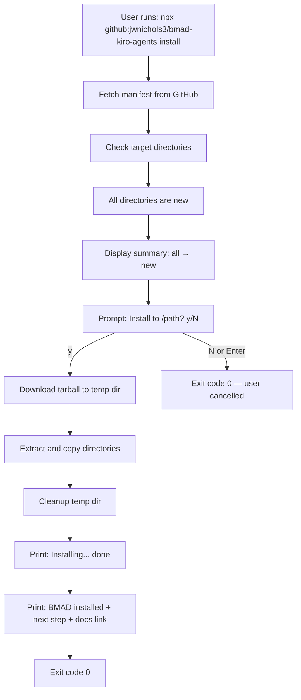
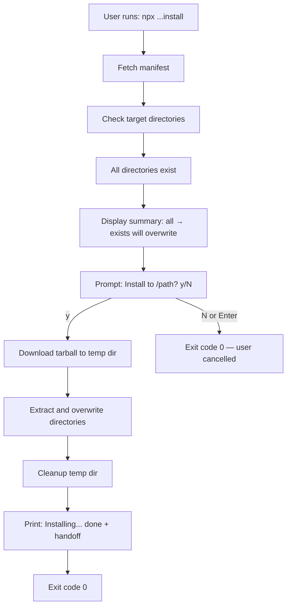
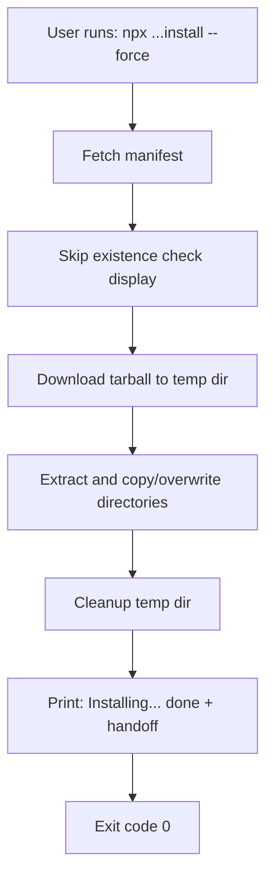
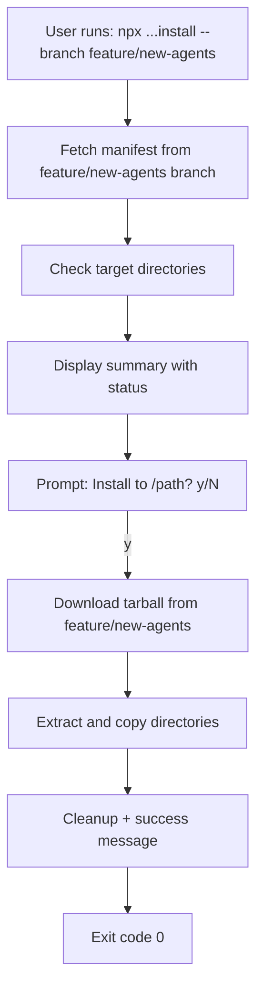
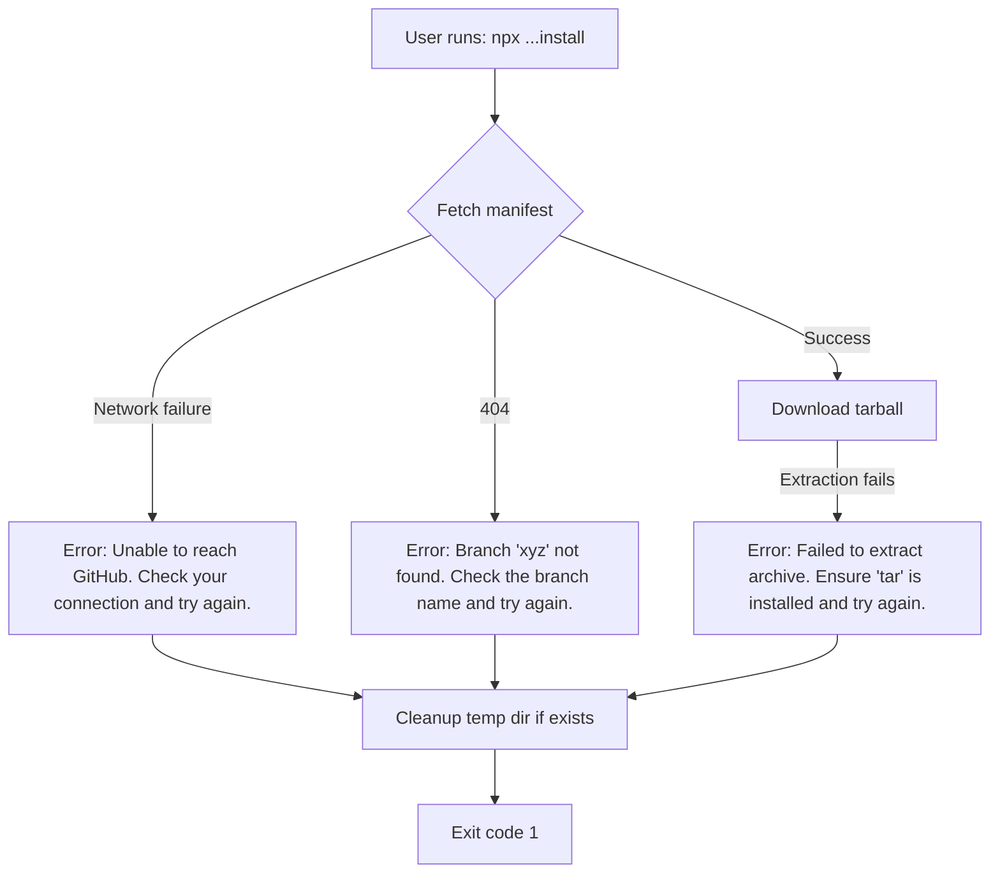

# UX Design Specification bmad-kiro-agents

**Author:** Rocket
**Date:** 2026-02-08

---

## Executive Summary

### Project Vision

bmad-kiro-agents is a zero-dependency npx CLI installer that eliminates the cognitive load of manually setting up BMAD methodology files for Kiro CLI projects. The UX goal is a "one breath" experience — from command invocation to productive BMAD workflow with zero friction, zero ambiguity, and zero partial states.

### Target Users

**Rocket — Solo Developer, BMAD Practitioner**
Weekly user who sets up BMAD across multiple projects. Deep CLI fluency, deep BMAD familiarity, zero patience for ceremony. Current pain: remembering multiple `cp` commands and directory structures. Success state: never thinking about the installation process again.

### Key Design Challenges

1. **One-breath fluidity** — The entire CLI interaction (invoke → summary → confirm → done) must feel like a single uninterrupted motion. Any unnecessary output or ambiguous prompt breaks flow.
2. **Terminal information density** — The pre-install summary must communicate new vs. overwrite status at a glance without visual clutter. Plain text, no decoration, scannable in under 2 seconds.
3. **Error messages as the entire UX** — No fallback help pages exist. Each error must be a self-contained diagnosis + action in a single line.

### Design Opportunities

1. **Post-install launchpad** — The success message is the emotional peak. Providing the exact next Kiro CLI command creates momentum from "installed" to "working" with no gap.
2. **Progressive trust via --force** — First-time users see the full summary; repeat users skip it. The UX rewards familiarity without penalizing caution.
3. **Composability** — Clean stdout/stderr separation and exit codes make the tool scriptable, enabling power-user workflows like batch-updating five projects in a row.

## Core User Experience

### Defining Experience

The core experience is a seamless transition: "I have a project" → "I have a BMAD-powered project." The install command is a bridge, not a destination. The interaction is a linear terminal flow — invoke, glance at summary, confirm, receive next step. The entire interaction should take under 60 seconds and feel like a single uninterrupted motion.

### Platform Strategy

Terminal-native CLI on macOS and Linux, Node.js 18+. Plain text output only — no ANSI colors, no box-drawing, no console.table. The design language is clean, undecorated stdout with readline for interactive prompts. stdout for normal output, stderr for errors. Designed for both interactive use and scriptable composition via --force flag.

### Effortless Interactions

- **Happy path invisibility** — Type command, files appear, get next step. The tool is invisible when working correctly.
- **Idempotent confidence** — Re-running feels identical to fresh install. "Exists — will overwrite" is informational, not alarming.
- **Trust escalation** — --force feels like mutual trust between tool and user, not like skipping safety.
- **Copy-paste handoff** — Post-install success message includes the exact next command, ready to copy-paste.

### Critical Success Moments

1. **The summary glance** — Directory list with new/exists status, scannable in under 2 seconds.
2. **The post-install launchpad** — Success message with exact Kiro CLI command creates zero-gap momentum into real work.
3. **The clean error** — Single-line actionable error message, no partial state, re-run works immediately after fixing the issue.

### Experience Principles

1. **Invisible when working** — The best install is one you don't remember. Do the job, get out of the way.
2. **Scannable, not readable** — All output designed for glancing, not studying. Status at a glance, confirm in one keystroke.
3. **Momentum, not ceremony** — Every element accelerates the user into their real work. Post-install is a launchpad, not a congratulations screen.
4. **Honest on failure** — Plain language diagnosis + action in a single line. No stack traces, no cryptic codes, no partial state.

## Desired Emotional Response

### Primary Emotional Goals

**Effortless competence** — The tool makes the user feel like a pro with a dialed-in workflow. The dominant feeling is quiet confidence: "I typed one command and everything is exactly where it should be." The tool is an extension of the user's expertise, not a separate thing to learn or manage.

### Emotional Journey Mapping

| Stage | Desired Feeling | Anti-Pattern |
|---|---|---|
| Invocation | Confident — "I know this command" | Hesitation — "did I get the syntax right?" |
| Summary display | Informed, in control — "that's what I expected" | Surprise — "wait, what's it doing?" |
| Confirmation prompt | Respected — quick check-in, not interrogation | Blocked — "just do it already" |
| Installation | Nothing — quiet competence, brief silence | Impatience — unnecessary progress indicators |
| Success message | Momentum — "here's my next move" | Completion — "congrats, you installed a thing" |
| Error | Oriented — "I know how to fix this" | Abandoned — "it broke and I'm stuck" |

### Micro-Emotions

- **Confidence over confusion** — Every output line reinforces that the tool is doing exactly what you'd expect.
- **Trust over skepticism** — Idempotent behavior means re-running is safe. The overwrite summary is informational, not alarming.
- **Accomplishment over frustration** — The post-install handoff creates a sense of forward progress, not just task completion.
- **Calm over anxiety** — Clean failure with no partial state means errors are recoverable, not catastrophic.

### Design Implications

- **Confidence** → Predictable output format. Same structure every time. No surprises in what gets printed.
- **Respect** → Single confirmation prompt, not per-directory. One keystroke to proceed. --force for repeat users.
- **Momentum** → Success message leads with the next command, not a "done!" celebration. The user's eyes land on their next action.
- **Orientation on failure** → Error messages follow a consistent pattern: what happened + what to do. Never just "Error: something went wrong."

### Emotional Design Principles

1. **Quiet confidence** — The tool's tone is competent and understated. No exclamation marks, no emoji, no celebratory language. Just clear, professional output.
2. **Forward motion** — Every interaction point pushes the user toward their real work. Nothing in the output exists for the tool's sake — only for the user's next step.
3. **Safe to re-run** — The emotional safety net is idempotency. The user should never feel nervous about running the command again.
4. **Proportional response** — Output volume matches the significance of what happened. A successful install gets a few lines. An error gets one line. Nothing gets a wall of text.

## UX Pattern Analysis & Inspiration

### Inspiring Products Analysis

**Heroku CLI** — The primary inspiration for bmad-kiro-agents output design.
- Verb-first command structure with confident, matter-of-fact tone
- Compact structured output — one line per meaningful piece of information
- Arrow prefix convention (▸ for warnings, → for info) creates visual rhythm without decoration
- Progressive disclosure — minimal default output, verbose available when needed
- "Creating... done" pattern — brief action + result, no celebration
- Professional and understated personality that respects the user's time and intelligence

### Transferable UX Patterns

**Output density (from Heroku):**
- Each line of output earns its place. No filler, no narration for fast operations.
- Action summaries use consistent formatting: indented directory list with arrow status indicators.
- Completion is stated once, plainly: "Installing... done"

**Prompt minimalism (from Heroku):**
- Single confirmation prompt with sensible default. One keystroke to proceed.
- The prompt includes context (target path) so the user confirms with full awareness.

**Post-action handoff (from Heroku):**
- After completion, the very next thing the user sees is their next action — not a summary of what just happened.
- Links and commands are printed bare, ready to copy-paste.

### Anti-Patterns to Avoid

1. **Step-by-step narration** — No "Downloading... Extracting... Copying..." for a 3-second operation. One "Installing... done" is sufficient.
2. **ASCII art / banners** — No version headers, logos, or decorative output on every run.
3. **Redundant confirmation** — No "Successfully completed successfully." State the result once.
4. **Multiple prompts** — One confirmation for the entire operation, not per-directory.
5. **Help text on error** — Errors print the specific fix, not the full usage guide.

### Design Inspiration Strategy

**Adopt from Heroku:**
- Compact, indented output structure with arrow status indicators
- Confident, matter-of-fact tone — "done" not "Successfully completed!"
- Post-action next-step pattern — lead with the command the user should run next

**Adapt for our context:**
- Heroku's arrow prefix (▸/→) simplified to plain → for directory status, keeping the architecture's "no ANSI" constraint
- Heroku's multi-command breadth reduced to our single-command depth — all output polish focused on the one `install` flow

**Avoid:**
- npm-style verbose dependency trees and timing stats
- Wizard-style multi-step prompting
- Any output that exists for the tool's benefit rather than the user's next action

## Design System Foundation

### Design System Choice

**Heroku-inspired structured plain text** — A minimal CLI output language built from consistent formatting conventions rather than a visual component library. The "design system" is a set of rules for how text is structured, spaced, and presented in the terminal.

### Rationale for Selection

- Zero-dependency constraint eliminates all TUI frameworks (ink, blessed, chalk)
- Architecture explicitly bans ANSI colors, box-drawing characters, and console.table
- A 3-second operation doesn't warrant spinners or progress bars
- Heroku CLI inspiration validates that structured plain text can feel polished and professional
- Single-file ~50-100 line scope means the formatting rules must be simple enough to enforce inline

### Implementation Approach

**Output tokens (the "components" of our design system):**

| Token | Format | Usage |
|---|---|---|
| Directory status | `  .kiro/agents/  → new` | Pre-install summary list |
| Overwrite status | `  _bmad/         → exists (will overwrite)` | Pre-install summary list |
| Action line | `Installing... done` | During install |
| Prompt | `Install to /path? (y/N) ` | Confirmation |
| Next step | `  kiro-cli chat --agent bmad-analyst --trust-all-tools` | Post-install handoff |
| Link | `Docs: https://github.com/...` | Post-install reference |
| Error | `Error: Unable to reach GitHub. Check your connection and try again.` | Any failure |

**Spacing rules:**
- Directory list items indented 2 spaces
- Blank line before and after the directory summary block
- Blank line before the prompt
- Blank line between "done" and the next-step section
- No trailing blank lines

### Customization Strategy

Not applicable in the traditional sense — there are no themes or brand tokens. The "customization" surface is the `bmad-manifest.json` file, which controls which directories appear in the summary. Adding a new directory to the manifest automatically extends the output without any formatting code changes.

## Defining Experience

### The Core Interaction

"One command, files land, here's your next step." The defining experience is a seamless transition from "I need BMAD in this project" to "I'm running BMAD workflows" — in under 60 seconds, with under 10 seconds of active user attention.

### User Mental Model

The user's mental model is "copy my stuff over," not "install software." They already know what directories need to exist and where. The installer automates a manual process they've done many times. This means the tool should feel like a shortcut — fast, familiar, no learning curve — not a wizard that walks them through decisions they've already made.

**Current pain points the defining experience resolves:**
- Remembering source paths from a local repo clone
- Remembering which directories map to which locations
- No feedback on whether the copy was complete or correct
- No awareness of what already exists vs. what's new

### Success Criteria

1. User types one command and doesn't need to consult docs or remember flags
2. Pre-install summary is scannable in under 2 seconds
3. Confirmation requires exactly one keystroke
4. No output during the install operation itself (silence = working)
5. Post-install message puts the next command in front of the user's eyes immediately
6. The entire interaction completes in under 60 seconds end-to-end
7. Re-running the command feels identical to the first run (idempotent confidence)

### Novel UX Patterns

No novel patterns required. The interaction uses entirely established CLI conventions:
- Positional args and flags (standard CLI)
- Summary list before destructive action (standard confirmation pattern)
- y/N prompt with default (standard readline)
- "Action... done" completion (Heroku-established)
- Post-action next-step suggestion (common in modern CLIs)

The innovation is in the *restraint* — what we leave out. No progress bars, no step-by-step narration, no version banners, no color. The novelty is the discipline of doing less.

### Experience Mechanics

**1. Initiation**
```
$ npx github:jwnichols3/bmad-kiro-agents install
```
Single command, no required flags. Optional: `--branch`, `--force`, `<target-dir>`.

**2. Feedback — Pre-Install Summary**
```
  .kiro/agents/  → new
  .kiro/skills/  → new
  _bmad/         → exists (will overwrite)

Install to /Users/rocket/my-project? (y/N)
```
Indented directory list with → status. Path shown in prompt for confirmation context. Default is N (safe default).

**3. Execution**
```
Installing... done
```
Single line. No intermediate output for a fast operation.

**4. Completion — The Launchpad**
```
BMAD installed. Next step:
  kiro-cli chat --agent bmad-analyst --trust-all-tools

Docs: https://github.com/jwnichols3/bmad-kiro-agents#readme
```
"Next step:" label with indented command (copy-paste ready). Docs link on its own line. User's eyes land on their next action.

**5. Error (any failure)**
```
Error: Unable to reach GitHub. Check your connection and try again.
```
Single line. What happened + what to do. No partial state left behind.

## Visual Design Foundation

### Character Palette

The "color system" for a plain-text CLI is the set of characters used for structure and emphasis:

| Character | Role | Example |
|---|---|---|
| `→` | Status indicator / flow arrow | `.kiro/agents/  → new` |
| `...` | In-progress action | `Installing... done` |
| `?` | Prompt suffix | `Install to /path? (y/N)` |
| `(y/N)` | Choice indicator, caps = default | Standard readline convention |
| `:` | Label separator | `Next step:`, `Docs:`, `Error:` |

No emoji. No Unicode box-drawing. No ASCII art. The → character is the single decorative element — everything else is standard ASCII.

### Typography System

Terminal output inherits the user's monospace font. No font choices to make — but hierarchy still matters:

**Information hierarchy through structure, not style:**
1. Blank lines create section breaks (summary → prompt → result → handoff)
2. Indentation (2 spaces) signals "detail under a heading"
3. Labels with colons (`Next step:`, `Error:`) create scannable anchors
4. The prompt line stands alone — no indentation, includes the full path for context

**Line length:** No line should exceed 80 characters. Directory names and paths are the longest elements; the → status keeps lines compact.

### Spacing & Layout Foundation

**Vertical rhythm — the blank line is our primary layout tool:**

```
[blank — breathing room after command invocation]
  .kiro/agents/  → new
  .kiro/skills/  → new
  _bmad/         → exists (will overwrite)
[blank]
Install to /Users/rocket/my-project? (y/N) y
[blank]
Installing... done
[blank]
BMAD installed. Next step:
  kiro-cli chat --agent bmad-analyst --trust-all-tools
[blank]
Docs: https://github.com/jwnichols3/bmad-kiro-agents#readme
```

**Alignment rules:**
- Directory names left-aligned with 2-space indent
- → arrows aligned vertically across all directory lines (pad directory names to equal width)
- Status text (`new`, `exists (will overwrite)`) follows the arrow consistently
- Post-install command indented 2 spaces under its label

### Accessibility Considerations

- Plain text is inherently screen-reader friendly — no visual-only information
- No reliance on color for meaning (there is no color)
- The → character is readable by screen readers as "right arrow"
- Error messages written to stderr are distinguishable by assistive tools that separate streams
- Default answer capitalized in `(y/N)` — visual convention that works without color

## Design Direction Decision

### Design Directions Explored

Three CLI output directions were evaluated, each representing a different personality and information density:

- **Direction A: "The Minimalist"** — Maximum terseness. No path in prompt, minimal labels. Risk: too little context to confirm you're in the right directory.
- **Direction B: "The Confident Guide"** — Informative but restrained. Path in prompt, labeled sections, indented next-step command. Balances context with speed.
- **Direction C: "The Narrator"** — Step-by-step transparency. Shows fetch/download/extract phases, counts directories, repeats path. Risk: narrates a 3-second operation unnecessarily.

### Chosen Direction

**Direction B: "The Confident Guide"**

The canonical output for a fresh install with one existing directory:

```
  .kiro/agents/  → new
  .kiro/skills/  → new
  _bmad/         → exists (will overwrite)

Install to /Users/rocket/my-project? (y/N) y

Installing... done

BMAD installed. Next step:
  kiro-cli chat --agent bmad-analyst --trust-all-tools

Docs: https://github.com/jwnichols3/bmad-kiro-agents#readme
```

Error format: `Error: Unable to reach GitHub. Check your connection and try again.`

### Design Rationale

- Shows target path in the prompt — confirms the user is in the right directory without a separate line
- "BMAD installed." is a one-line confirmation that something happened, without celebration
- Indented next-step command is visually distinct and copy-paste ready
- Single "Installing... done" line respects the proportional response principle — no narration for a fast operation
- Error messages include what happened + what to do, at medium specificity (not cryptic, not verbose)

### Implementation Approach

Direction B maps directly to the architecture's seven helper functions:
- `checkExisting()` → generates the directory status list
- `promptUser()` → renders the "Install to /path? (y/N)" line
- `main()` success path → prints "Installing... done" then the handoff block
- `main()` catch block → prints "Error: {message}" to stderr

No additional formatting utilities needed. The output tokens defined in the Visual Foundation section are sufficient to implement Direction B entirely inline.

## User Journey Flows

### Journey 1: Fresh Project Setup

The golden path. Everything is new, nothing to overwrite.



**Exact output:**
```
  .kiro/agents/  → new
  .kiro/skills/  → new
  _bmad/         → new

Install to /Users/rocket/my-project? (y/N) y

Installing... done

BMAD installed. Next step:
  kiro-cli chat --agent bmad-analyst --trust-all-tools

Docs: https://github.com/jwnichols3/bmad-kiro-agents#readme
```

### Journey 2: Updating an Existing Project

All directories exist. The summary reflects overwrite status.



**Exact output:**
```
  .kiro/agents/  → exists (will overwrite)
  .kiro/skills/  → exists (will overwrite)
  _bmad/         → exists (will overwrite)

Install to /Users/rocket/my-project? (y/N) y

Installing... done

BMAD installed. Next step:
  kiro-cli chat --agent bmad-analyst --trust-all-tools

Docs: https://github.com/jwnichols3/bmad-kiro-agents#readme
```

### Journey 3: Quick Update with --force

No prompts. Immediate execution.



**Exact output:**
```
Installing... done

BMAD installed. Next step:
  kiro-cli chat --agent bmad-analyst --trust-all-tools

Docs: https://github.com/jwnichols3/bmad-kiro-agents#readme
```

*Note: --force skips the summary and prompt entirely. The user trusts the tool — the tool trusts the user. Minimal output.*

### Journey 4: Branch Testing

Same flow as Journey 1/2, but pulls from a feature branch.



**Output is identical to Journey 1 or 2** — the branch flag is invisible in the output. The user specified it; they know which branch they're pulling from. No need to echo it back.

### Journey 5: Error Recovery

Three error scenarios, each with a single-line actionable message.



**Error output examples:**
```
Error: Unable to reach GitHub. Check your connection and try again.
```
```
Error: Branch 'feature/typo' not found. Check the branch name and try again.
```
```
Error: Failed to extract archive. Ensure 'tar' is installed and try again.
```

All errors: one line to stderr, cleanup any temp state, exit code 1. User fixes the issue, re-runs, it works.

### Journey Patterns

**Consistent patterns across all journeys:**

1. **Entry is always the same command** — only flags vary. No subcommands to remember.
2. **Summary → Prompt → Action → Handoff** — the four-beat rhythm of every interactive flow.
3. **--force collapses the rhythm** — skips summary and prompt, goes straight to action → handoff.
4. **Errors are always one line** — pattern: "Error: {what happened}. {what to do}."
5. **Success always ends with the launchpad** — every successful path prints the next Kiro CLI command.
6. **User cancellation is silent** — answering N exits cleanly with code 0, no message needed.

### Flow Optimization Principles

1. **No redundant confirmation** — the path shown in the prompt IS the confirmation of location. No separate "You are about to install to..." line.
2. **Default is safe** — (y/N) defaults to N. Accidental Enter doesn't overwrite anything.
3. **--force is the power-user escape hatch** — designed for batch updates, not for skipping safety. The naming is honest.
4. **Branch is invisible in output** — the user specified it, they know. Don't echo it back unless there's an error with it.
5. **Temp dir is invisible** — the user never sees temp directory paths. It's an implementation detail, not a UX element.

## Component Strategy

### Design System Components

Not applicable — there is no external component library. The design system is the set of plain-text formatting conventions defined in the Visual Design Foundation. All components are custom, built from those conventions.

### Custom Components

**Component 1: Directory Status List**

- **Purpose:** Show the user what will be installed and whether each directory is new or existing
- **Content:** One line per manifest directory, indented, with → status
- **States:** Two per line: `→ new` or `→ exists (will overwrite)`
- **Format:**
  ```
    .kiro/agents/  → new
    .kiro/skills/  → new
    _bmad/         → exists (will overwrite)
  ```
- **Rules:** 2-space indent. Directory names padded to equal width for arrow alignment. Blank line before and after the block.

**Component 2: Confirmation Prompt**

- **Purpose:** Get user confirmation before proceeding with install
- **Content:** Target path + y/N choice
- **States:** Waiting for input. Accepts y, Y, n, N, or Enter (default N).
- **Format:** `Install to /Users/rocket/my-project? (y/N) `
- **Rules:** No indentation. Trailing space after closing paren. Default is N (capitalized). Not shown when `--force` is active.

**Component 3: Action Line**

- **Purpose:** Indicate the install is happening and when it's done
- **Content:** Single line with ellipsis pattern
- **Format:** `Installing... done`
- **Rules:** No indentation. "done" appended on same line after operation completes. No intermediate states.

**Component 4: Success Handoff Block**

- **Purpose:** Confirm completion and provide the user's next action
- **Content:** Confirmation line, labeled next-step command, docs link
- **Format:**
  ```
  BMAD installed. Next step:
    kiro-cli chat --agent bmad-analyst --trust-all-tools

  Docs: https://github.com/jwnichols3/bmad-kiro-agents#readme
  ```
- **Rules:** "BMAD installed." on its own line with "Next step:" label. Command indented 2 spaces (copy-paste ready). Blank line before docs link. Docs link bare, not wrapped in brackets or markdown.

**Component 5: Error Message**

- **Purpose:** Tell the user what went wrong and what to do
- **Content:** "Error:" prefix + description + action
- **Format:** `Error: Unable to reach GitHub. Check your connection and try again.`
- **Rules:** Written to stderr. Single line. Always starts with "Error:". Two sentences: what happened, what to do. No stack traces.

### Component Implementation Strategy

All five components are implemented as inline `console.log` / `console.error` calls within the helper functions defined in the architecture. No abstraction layer or component rendering system is needed — the tool is ~50-100 lines and each component appears exactly once in the code.

| Component | Implemented In | Output Target |
|---|---|---|
| Directory Status List | `checkExisting()` return → `promptUser()` display | stdout |
| Confirmation Prompt | `promptUser()` via readline | stdout |
| Action Line | `main()` before/after install | stdout |
| Success Handoff Block | `main()` after successful install | stdout |
| Error Message | `main()` catch block | stderr |

### Implementation Roadmap

All components are needed for MVP — there is no phased rollout. The tool has a single flow, and every component participates in every successful execution. Implementation order follows the execution flow:

1. Directory Status List + Confirmation Prompt (they appear together)
2. Action Line (bridges prompt to completion)
3. Success Handoff Block (the emotional payoff)
4. Error Message (the safety net)

## UX Consistency Patterns

### Feedback Patterns

Every piece of output falls into one of four feedback categories:

| Category | Format | Target | Example |
|---|---|---|---|
| Status info | `  {name}  → {status}` | stdout | `  .kiro/agents/  → new` |
| Action confirmation | `{Action}... done` | stdout | `Installing... done` |
| Success handoff | `{Result}. Next step:\n  {command}` | stdout | `BMAD installed. Next step:\n  kiro-cli chat...` |
| Error | `Error: {what}. {fix}.` | stderr | `Error: Unable to reach GitHub. Check your connection and try again.` |

**Rules:**
- Status info is always indented 2 spaces
- Action confirmations are never indented
- Success handoff always includes a next action
- Errors always go to stderr, always start with "Error:", always include a fix

### Prompt Patterns

The tool has exactly one prompt pattern. It is used identically every time:

```
{Question}? (y/N) 
```

**Rules:**
- Question includes enough context to answer without scrolling up (e.g., the target path)
- Default is always N (safe default) — capitalized to indicate
- Accepts: y, Y, n, N, Enter (= N)
- Any other input re-prompts (no error message, just ask again)
- Prompt is suppressed entirely when `--force` is active
- User cancellation (N) exits with code 0 and no output — silence means "okay, nevermind"

### Error Patterns

All errors follow the same two-sentence structure:

```
Error: {What happened}. {What to do}.
```

**Specific error messages (exhaustive list for MVP):**

| Trigger | Message |
|---|---|
| Network failure on manifest fetch | `Error: Unable to reach GitHub. Check your connection and try again.` |
| 404 on manifest (bad branch) | `Error: Branch '{name}' not found. Check the branch name and try again.` |
| Manifest JSON parse failure | `Error: Invalid manifest file. The repository may be corrupted.` |
| Tarball download failure | `Error: Failed to download archive. Check your connection and try again.` |
| tar extraction failure | `Error: Failed to extract archive. Ensure 'tar' is installed and try again.` |
| Filesystem write failure | `Error: Failed to write files. Check directory permissions and try again.` |

**Rules:**
- Never show stack traces
- Never show URLs or technical details (temp paths, HTTP status codes)
- Always actionable — the user knows what to try next
- All errors clean up temp state before exiting
- Exit code is always 1

### Output Structure Patterns

**The four-beat rhythm** applies to every interactive execution:

```
1. SUMMARY    →  Directory status list (indented, aligned)
2. PROMPT     →  Confirmation with path context
3. ACTION     →  "Installing... done"
4. HANDOFF    →  Result + next command + docs link
```

**Variations:**
- `--force` collapses to beats 3 + 4 only
- Error at any point replaces remaining beats with a single error line
- User cancellation at beat 2 produces no further output

**Whitespace rhythm:**
- Blank line after beat 1 (before prompt)
- Blank line after beat 2 (after user confirms)
- Blank line after beat 3 (before handoff)
- Blank line between next-step command and docs link in beat 4
- No trailing blank line at the end

## Responsive Design & Accessibility

### Responsive Strategy

**Terminal width adaptation:**
The tool does not dynamically adapt to terminal width — it uses a fixed-width output format designed to work in the narrowest common case (80 columns). This ensures consistent output regardless of terminal size.

- Directory status lines are under 60 characters (fits 80-column terminals with room to spare)
- Error messages are single lines under 80 characters
- The post-install handoff block is the widest element; the Kiro CLI command is ~55 characters

**No responsive breakpoints needed** — the output is simple enough that it renders identically in any terminal width ≥80 columns.

**Context adaptation:**
- Interactive mode (default): shows summary, prompts for confirmation
- Non-interactive mode (`--force`): skips prompts, suitable for scripts and CI/CD
- The tool auto-detects nothing — the user explicitly chooses via `--force`

### Breakpoint Strategy

Not applicable. Terminal output is inherently single-column and does not reflow. The "breakpoint" is the 80-column assumption, which is the de facto standard for CLI tools.

### Accessibility Strategy

**WCAG compliance level:** Not formally applicable (WCAG is for web content), but the tool follows equivalent principles for CLI accessibility.

**Accessibility by design:**

| Principle | Implementation |
|---|---|
| No color dependency | Plain text only. No ANSI colors. Status conveyed through text (`→ new` vs `→ exists`). |
| Screen reader friendly | Linear text output. No cursor manipulation. No clearing/rewriting lines. |
| Keyboard accessible | CLI is inherently keyboard-only. Single-character confirmation (y/N). |
| Predictable structure | Same four-beat rhythm every time. Errors always start with "Error:". |
| Clear language | No jargon in user-facing output. Error messages are plain English with actionable fixes. |
| stdout/stderr separation | Assistive tools that distinguish streams can separate normal output from errors. |

**The → character:** Unicode arrow (U+2192) is readable by screen readers as "right arrow" or "rightwards arrow." It's a single character, not an ASCII art approximation, so it's parsed correctly.

### Testing Strategy

**Terminal compatibility testing:**
- macOS Terminal.app
- iTerm2
- VS Code integrated terminal
- Linux default terminals (GNOME Terminal, Konsole)
- SSH sessions (to verify no local-only dependencies)

**Accessibility testing:**
- VoiceOver on macOS (read the output aloud, verify it makes sense)
- Verify `--force` mode works in non-TTY contexts (piped input, CI runners)
- Verify exit codes are correct for scripting (0 = success or user cancel, 1 = error)

**No automated accessibility testing** — the output is too simple to warrant tooling. Manual verification with a screen reader is sufficient.

### Implementation Guidelines

**For developers implementing this spec:**

1. Use `console.log` for stdout, `console.error` for stderr — never mix
2. No ANSI escape codes — not even for "clearing" the line
3. No `process.stdout.write` tricks to update in place — each line is final
4. The → character is literal Unicode, not escaped
5. Test with `| cat` to verify output looks correct when piped (no TTY)
6. Test with VoiceOver enabled to hear how the output sounds
